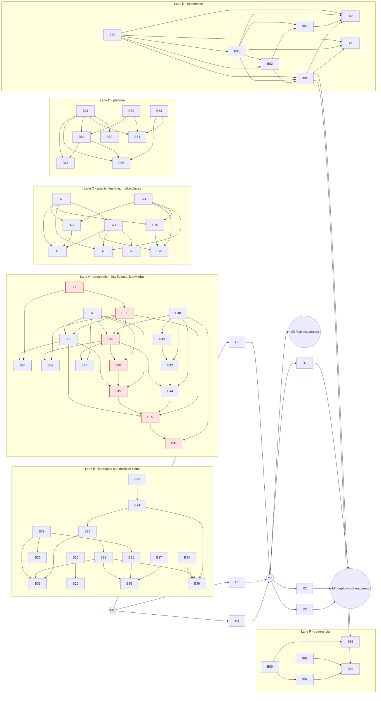

# THE EYE — Finite Delivery Plan (baseline 2026-09-24)

**Status of this file.** This is the one scheduling baseline from the current checkpoint to the complete product: all eleven volumes and the integrated NORDWERK demonstration. It adds no merge, deployment, purchase or budget authorization.

It decomposes the owner's packages (R0, P1–P7-F in `audit/The_Eye_Full_Product_Delivery_Register_2026-09-09.md`) and schedule steps S5–S7 of `FULL_PRODUCT_DELIVERY_REGISTER.md` §9 into fixed stages. Those files stay as written. §10 of the register points here.

The machine-readable companions are authoritative for per-item detail:

| File | What it holds |
|---|---|
| `audit/delivery/FEATURE_TRACKER.csv` | **The progress tracker.** One row per feature (201 open-register features, 14 delivered baselines and one not-applicable bucket) with feature ID, spec refs, volumes, stage, milestone, owner, dependencies, status, row counts, delivered and remaining clauses, external prerequisites, effort range, target date, NORDWERK scenes and evidence pointers |
| `audit/delivery/feature-rowmap.csv` | Every one of the 6,264 atomic requirement rows (`audit/requirements/*.csv`) mapped to exactly one feature |
| `audit/delivery/STAGES.csv` | The 65 stages: scope, dependencies, effort, owner, target dates, scenes and completion conditions |
| `audit/delivery/feature-tracker.mjs` | Check: recomputes every count and status from the requirement rows. Fails on an unmapped row, a stale count, or an open feature without a stage. `--write` refreshes the count columns |
| `audit/delivery/DEMONSTRATION_PLAN.md` | The NORDWERK story: what the demonstration already proves and the scenes each stage adds |
| `audit/delivery/ACCOUNT_PROMPTS.md` | Ready-to-copy prompts for the proposed accounts (proposal only; nothing activated) |
| `audit/delivery/STALE_STATUS_CANDIDATES.csv` | 49 register rows whose status looks stale against the code. They move only in B23's records step after checking; never moved blindly |

## 0. Verified checkpoint

| Item | Value (verified 2026-09-24) |
|---|---|
| `main` | `5165a97` (#59 merged; its C17 finalize and C19 anchor chain completed) |
| PR #60 (B22) | Head `7125550` (candidate `9f6a77e` + records). Every check green: build-test, supply-chain, browser-regression, lifecycle ubuntu/macOS, delivery-chain-dry, foreign-checkout-pinning, CodeRabbit. **The merge awaits the owner's word** |
| B23 | Not started |
| Demonstration | `eye_demo` through 0083 on the official image pins. API :3401 runs the B22 build; web :3000 is up. Backups under `.eye-local/backups/` are preserved |
| Interface register | 44 bound / 6 partial / 0 unbound |
| Acceptance units | 3,555 open-register units = 3,179 open + 339 verified locally + 37 verified in CI. **This is verification, not implementation completion; no percentage is derived from it** |
| Local machine | 14 cores, 24 GB RAM, 28 GB free disk. About 229 scratch verification databases hold ~17 GB; clearing them is housekeeping and needs no decision |

## 1. Milestones (distinct; none implies the next)

| Milestone | Meaning | Gate | Target (3 accounts, expected) |
|---|---|---|---|
| **M1 Implementation complete** | Every implementation stage B23–B94 merged. Every remaining functional clause is implemented on `main`, with focused harnesses, the required gates and a demonstration scene | Every B-stage's completion conditions (STAGES.csv) | **2027-02-09** (range 2027-01-08 … 2027-04-09) |
| **M2 Comprehensive hardening** | H1–H3 closed: contracts, envelopes, freshness, platform hardening, experience acceptance and product governance | H-stage conditions and the full hosted chain | **2027-02-19**, plus external auditors' lead time (WCAG, pentest) |
| **M3 Final acceptance** | Every applicable mandatory acceptance unit verified on the released artifact, and the owner's end-to-end demonstration walk | Register §9 S7: an owner, a date or a dependency never closes a unit | Most units are verified in their own stage. The residual sweep is 3–6 weeks after M2: **2027-03-12 … 2027-04-02** (low confidence; see §9) |
| **M4 Deployment readiness** | R1–R3: SaaS / private-cloud / on-prem profiles, production proof, the commercial and investor package | External prerequisites in hand; the owner's acceptance | **Externally gated.** Earliest about 6–9 weeks after the infrastructure and approvals exist |

## 2. Feature map (the classification)

Status is **computed from the requirement rows**, never judged:

- **functioning**: every row implemented or not applicable.
- **missing**: every row missing.
- **partial**: anything in between.
- **externally blocked**: carried from the characterization; the feature cannot complete without a named external prerequisite.

The checker recomputes this on every run.

### 2.1 Counts (open-register features)

| Status | Features |
|---|---|
| functioning | 1 (F-R0-01, the closed strategic loop with Decision Replay) |
| partial | 167 |
| missing | 15 |
| externally blocked | 18 |
| **Total** | **201** |

Separately, 14 delivered baselines (`F-DONE-<area>`, 686 rows in the register's `done` package) and 26 not-applicable rows (`F-NA`) account for the rest of the 6,264 rows. Row counts: implemented 984 · partial 2,722 · missing 2,532 · not-applicable 26. These are counts, not a completion measure. **Acceptance verification is a separate ledger** (the 3,555 units above).

| Package | Features | functioning | partial | missing | ext. blocked | Rows (impl / partial / missing) |
|---|---|---|---|---|---|---|
| R0 | 6 | 1 | 4 | 0 | 1 | 49 (9 / 35 / 5) |
| P1 World Observation | 17 | 0 | 14 | 1 | 2 | 238 (22 / 127 / 89) |
| P2 Intelligence | 18 | 0 | 16 | 1 | 1 | 236 (11 / 174 / 51) |
| P3 Memory / KG / Strategy Graph | 18 | 0 | 17 | 0 | 1 | 364 (45 / 251 / 68) |
| P4 Prediction / Scenarios / Warnings | 16 | 0 | 14 | 2 | 0 | 290 (25 / 141 / 124) |
| P5 Twins / Simulation | 9 | 0 | 8 | 0 | 1 | 143 (40 / 91 / 12) |
| P6 Decision / Executive OS | 16 | 0 | 14 | 1 | 1 | 293 (29 / 182 / 82) |
| P7-A Agents | 17 | 0 | 14 | 2 | 1 | 320 (4 / 149 / 167) |
| P7-B Learning / Evaluation | 13 | 0 | 11 | 2 | 0 | 257 (5 / 134 / 118) |
| P7-C Marketplaces | 9 | 0 | 6 | 2 | 1 | 97 (1 / 43 / 53) |
| P7-D Trust / Infrastructure / Profiles | 25 | 0 | 22 | 0 | 3 | 1,707 (41 / 755 / 911) |
| P7-E UX / Accessibility / Localization | 21 | 0 | 19 | 0 | 2 | 910 (57 / 543 / 310) |
| P7-F Commercial / Interoperability | 16 | 0 | 8 | 4 | 4 | 648 (9 / 97 / 542) |

By milestone: 167 features belong to M1 implementation, 19 to M2 hardening and 15 to M4 deployment readiness. Raw effort (one unit is about one B20–B22-sized batch-day of an account):

| Milestone | Effort units |
|---|---|
| Implementation | 353–601 |
| Hardening | 29–53 |
| Deployment readiness | 27–53 |

### 2.2 Delivered versus remaining clauses

Each tracker row carries its `delivered` clauses (with migration and evidence pointers) and its `remaining` clauses. That is the split of every partial capability. Examples:

- **F-P6-07** (attention). Delivered in B22 (0083): the versioned policy, the materiality engine, the queue, the page, and the policy cause for reopen. Remaining: the MaterialChangeRaised routing (B23), transport beyond in-app, the timer host, the remaining materiality dimensions and the overload rule, the suppression approval, delegation, queue evaluation, and markers that constrain decision-active use.
- **F-R0-02** (contracts). Delivered: the outbox and the consumers of 0060/0063/0083. Remaining: the H1 contract-hardening clauses.

### 2.3 Status where the characterization and the row arithmetic differ

Seven features read "missing" in the characterization but compute as **partial**, because a few of their rows are partial:

| Feature | Partial rows |
|---|---|
| F-P1-07 | 2 of 8 |
| F-P1-08 | 2 of 28 |
| F-P1-09 | 3 of 21 |
| F-P7D-09 | 28 of 110 |
| F-P7D-10 | 5 of 52 |
| F-P7D-13 | 10 of 29 |
| F-P7D-23 | 17 of 75 |

The tracker keeps the computed status. The capability is largely absent in each case, and the effort ranges already reflect that.

### 2.4 The externally blocked and missing features

**Externally blocked (18):**

| Feature | Stage | What it needs |
|---|---|---|
| F-R0-06 | R2 | Production proof |
| F-P1-06 | B42 | Licensed feeds: Comtrade key, PortWatch permission, market, satellite and social |
| F-P1-17, F-P2-18, F-P3-18, F-P5-08, F-P6-15, F-P7A-09 | R1 | Per-layer profile conformance |
| F-P7C-09 | R3 | Marketplace commerce |
| F-P7D-21, F-P7D-22, F-P7D-24 | R1 | SaaS, private-cloud/on-prem and parity |
| F-P7-E-08 | H3 | Accessibility and usability studies |
| F-P7-E-09 | B85 | Translation and counsel |
| F-P7-F-13 | H3 | The named councils |
| F-P7-F-14, F-P7-F-15, F-P7-F-16 | R3 | Volume 10 claim control, data room, commercial model |

Where a synthetic substitute proves the software (B42's public feeds, B85's localization build), the stage delivers the software. The feature stays "externally blocked" until the prerequisite exists.

**Missing (15):**

| Feature | Stage | Capability |
|---|---|---|
| F-P1-10 | B43 | Edge / IoT |
| F-P2-07 | B47 | Media |
| F-P4-11 | B28 | Event-time streams |
| F-P4-15 | B33 | Domain packages |
| F-P6-08 | B32 | Strategic Health Score |
| F-P7A-05 | B70 | Message contracts |
| F-P7A-15 | B73 | Graph / memory / reasoning / dissent agents |
| F-P7B-06 | B75 | Evaluator models |
| F-P7B-12 | B76 | Agent incident workspace |
| F-P7C-05, F-P7C-06 | B78 | Scenario and data marketplaces |
| F-P7-F-04, F-P7-F-05 | B94 | Onboarding and adoption |
| F-P7-F-10 | B90 | Semantic metrics |
| F-P7-F-12 | H3 | Product-governance workspace |

### 2.5 Stale register rows (reconciled once, in B23)

`STALE_STATUS_CANDIDATES.csv` lists 49 rows whose text no longer matches the code. The characterization also flagged these areas:

- legal hold and retention (0066, 0070–0072); the credential path (0070)
- the correction consumer (0060); graph subscribers (0063–0065)
- the ontology and contradictions (0066); the memory workspace and index tier (0080)
- export and import (B11–B17); backups (`docs/ops/BACKUP_RESTORE.md`); the twin envelope (0081)
- scenario kinds (0058); warning levels (0061); reopen / invalidation (0078); the series-cache removal
- the B22 attention rows; evaluation status (0066); the agent budget stop; dead-letter (0015); the trust anchor (0073/0074)

B23's records step checks each against the code and moves the row with its evidence. No row moves on this list alone.

## 3. The stages

There are 65 fixed IDs. Full detail is in `STAGES.csv`.

**Lanes:**

| Lane | Scope |
|---|---|
| B | Interfaces and the decision spine (P4 / P5 / P6) |
| A | Observation, intelligence and knowledge (P1 / P2 / P3) |
| C | Agents, learning and marketplaces (P7-A / B / C) |
| D | Platform trust and infrastructure (P7-D) |
| E | Experience (P7-E) |
| F | Commercial and interoperability (P7-F) |
| H | Hardening (M2) |
| R | Deployment readiness (M4) |

"Effort" is in units (about one account-day of B20–B22 pace each). Dates are the 3-account expected plan, shown as start → merged.

### 3.1 B23 and the B22 deferrals (placed explicitly)

**B23 · Interface completion.** A1 · 4–7 units · 2026-09-28 → 2026-10-01. B23 completes no tracker feature on its own. It advances F-P6-12, F-P4-08, F-P3-08, F-P3-16, F-P1-09 and F-P6-14.

- The six partial interface rows: **L10-I02** MaterialChangeRaised (an event and its routing to accountable roles), **L10-I03** ReviewConvened, and the commands and the query **L1-I02, L3-I02, L4-I02, L7-I02**.
- **BRF@v2**: the briefing's attention section.
- The interface register moves to **50/0/0**.
- The one-time stale-row reconciliation (§2.5).
- Completion: a focused harness per interface row; the register assertion at 50/0/0; `act-b23` (a Bab el-Mandeb closure raises MaterialChangeRaised, the queue ranks it for the COO, and the weekly briefing gains its attention section); the hosted run green.

**B24 · Attention completion** (completes F-P6-07). A1 · 1.5–3 units · → 2026-10-05. Every B22 deferral:

| Deferral | Where it goes |
|---|---|
| Timer host for escalation | B24: a durable scheduled `escalate_due` |
| Transport beyond in-app | B24: a delivery port with receipts; a synthetic channel for the demonstration. Real email/SMS/Teams delivery is externally gated (notification provider; decision D6) |
| Remaining materiality dimensions and the overload rule | B24: probability, reversibility, exposure, strategic relevance, information value |
| Suppression approval, delegation records, queue evaluation | B24: precision/recall by class, ranking stability, severe-item visibility |
| Source-impact markers | B24: they constrain decision-active use (not only displayed) |
| The observations consumer's selected plan | B24: executed by the existing extraction service. Richer document plans come in B46 |
| AU-MEM-0067 | **B54**, resolved per object, **no waiver** (the owner's word stands) |

### 3.2 Implementation stages (M1)

| Stage | Lane | Scope | Completes | Depends on | Effort | Owner | Target |
|---|---|---|---|---|---|---|---|
| B23 | B | Interface completion (above) | — (advances 6) | — | 4–7 | A1 | 09-28 → 10-01 |
| B24 | B | Attention completion (above) | P6-07 | B23 | 1.5–3 | A1 | → 10-05 |
| B28 | B | Event-time streams, weak-signal workbench, the early-warning lifecycle | P4-11, P4-10, P4-12 | B24 | 7–12.5 | A1 | 10-05 → 10-14 |
| B29 | B | Twin families, composition, simulation methods | P5-05, P5-01 | — | 7–12 | A1 | 10-14 → 10-22 |
| B90 | F | Data products, semantic metrics, metadata catalog | F-09, F-10, F-11 | — | 6.5–10.5 | A1 | 10-22 → 10-30 |
| B32 | B | Strategy Graph risk/opportunity, Strategic Health Score | P6-09, P4-13, P6-08 | B28 | 7–12 | A1 | 11-02 → 11-11 |
| B34 | B | Durable workflow, human gates, commitments | P6-14, P6-04, P6-05 | — | 7–12 | A1 | 11-11 → 11-19 |
| B27 | B | Scenario anatomy, sets, coherence | P4-07, P4-08, P4-09 | — | 5–8.5 | A1 | 11-19 → 11-27 |
| B31 | B | Simulation orchestration, impact analysis, validity | P5-06, P5-07, P5-09 | B29 | 4.75–8.25 | A1 | 11-27 → 12-03 |
| B91 | F | Metering, cost ledger, entitlements, licensing | F-02, F-01 | — | 5–9 | A1 | 12-03 → 12-11 |
| B25 | B | Forecasting portfolio I: grounded context, multi-method horizons, ensembles | P4-03, P4-01, P4-02 | — | 6–10 | A1 | 12-14 → 12-21 |
| B92 | F | Product analytics, UX telemetry | F-03 | B90 | 3–5 | A1 | 12-22 → 12-25 |
| B36 | B | Strategic planning, executive home, BRF@v2 completion, publishing | P6-10…P6-13 | B24, B32, B34 | 9–15 | A1 | 12-25 → 01-06 |
| B35 | B | Decision analysis, recommendation, explanation/appeal, replay | P6-01, P6-02, P6-03, P6-06 | B27, B31, B32 | 8.5–13.5 | A1 | 01-07 → 01-18 |
| B94 | F | Onboarding/migration, service management, adoption | F-04, F-06, F-05 | B84, B91, B92 | 8–11 | A1 | 01-19 → 01-27 |
| B93 | F | Integration center, APIs/SDKs/webhooks, exit package | F-07, F-08 | B84, B90 | 4.5–8 | A1 | 01-28 → 02-04 |
| B50 | A | Knowledge core: canonical headers, lifecycle, provenance, timeline, corrections | P3-01…P3-05 | — | 8.5–15 | A2 | 09-28 → 10-13 |
| B40 | A | Source platform: registry/rights, vault, intake sandbox, acquisition policy | P1-01…P1-04, P1-12 | — | 7.5–14 | A2 | 10-06 → 10-14 |
| B45 | A | Model fabric: registry, evaluation harness, provider adapters, routing | P2-03, P2-15, P2-01, P2-02, P2-04 | — | 10–18.5 | A2 | 10-13 → 10-29 |
| B51 | A | Ontology, atomic graph revisions, graph reasoning | P3-07, P3-08, P3-09 | B50 | 6.5–11.5 | A2 | 10-23 → 11-02 |
| B43 | A | Event/stream/telemetry ingestion, edge collection | P1-09, P1-10 | B40 | 6–11 | A2 | 10-29 → 11-10 |
| B46 | A | Documents: parsing/OCR/chunking, language, NER/events | P2-06, P2-08, P2-09 | B40, B45, B51 | 7.5–13 | A2 | 11-05 → 11-18 |
| B42 | A | Public-source connectors, bulk/secure transfer, licensed-feed adapters | P1-05, P1-11, P1-06 | B40, B43 | 8.5–17 | A2 | 11-12 → 11-26 |
| B48 | A | Contradiction/corroboration, calibration, object inspector | P2-10, P2-14, P2-16 | B45, B46 | 5.5–10 | A2 | 11-23 → 12-02 |
| B70 | C | Agent runtime: packages/admission, durable workflow, message contracts | P7A-01, 02, 05, 07, 08 | — | 8–14.5 | A2 | 11-27 → 12-10 |
| B53 | A | Hybrid semantic retrieval, context assembly | P3-15, P3-16 | B45, B51 | 5.5–9 | A2 | 12-07 → 12-14 |
| B74 | C | Evaluation foundation: datasets, registry, metrics, AI inventory | P7B-04, 03, 05, 10 | — | 6.5–10.5 | A2 | 12-11 → 12-21 |
| B44 | A | Enterprise applications/CDC, crawler/search, intake agents | P1-08, P1-07, P1-16 | B40, B42, B46 | 8.5–16 | A2 | 12-17 → 01-05 |
| B71 | C | Planner, supervisor, checkpoints, agent control | P7A-03, 04, 06, 10 | B70 | 6–10.5 | A2 | 12-25 → 01-06 |
| B75 | C | Monitoring, red-team suites, release/canary/rollback, evaluator models | P7B-08, 07, 09, 06 | B70, B74 | 6.5–11 | A2 | 01-01 → 01-15 |
| B41 | A | Source health, quality SLOs, collection planning | P1-14, P1-15, P1-13 | B40, B55 | 6.5–11.5 | A2 | 01-07 → 01-18 |
| B76 | C | The Learn stage: lessons, attribution, governance console, incidents | P7B-01, 02, 11, 12, 13 | B71, B74, B75 | 6.5–10.5 | A2 | 01-14 → 01-26 |
| B73 | C | Specialist agent families | P7A-13…P7A-16 | B70, B71, B74 | 6–10 | A2 | 01-20 → 01-28 |
| B52 | A | Entity resolution, graph curation workspace | P3-10, P3-12 | B46, B51 | 4.5–7.5 | A2 | 01-27 → 02-03 |
| B72 | C | Agent Operations workspace, supervision surfaces | P7A-11, P7A-12 | B71 | 3.5–5.5 | A2 | 02-03 → 02-08 |
| B47 | A | Media intelligence: image, audio, video, geospatial | P2-07 | B45, B46 | 3–6 | A2 | 02-01 → 02-05 |
| B80 | E | Shell and foundations: tokens, component library, navigation | E-03, E-05, E-01 | — | 6–9.5 | A3 | 09-28 → 10-05 |
| B81 | E | Interaction patterns: human authority, degraded states, content, object grammar | E-20, 19, 18, 06, 04, 02 | B80 | 9.5–15.5 | A3 | 10-02 → 10-13 |
| B82 | E | Visualization library, trust/provenance experience | E-21, E-07 | B80, B81 | 5.5–9 | A3 | 10-12 → 10-22 |
| B60 | D | Canonical contracts, the state-class platform | 7D-15, 7D-14 | — | 7–12 | A3 | 10-16 → 10-30 |
| B61 | D | Identity federation/MFA/privileged access; keys, secrets, encryption | 7D-01, 7D-03 | — | 6–10 | A3 | 10-23 → 11-02 |
| B84 | E | Decision/briefing/publishing UX, attention center, governance administration | E-15, E-12, E-16 | B80, B81, B82 | 8–13 | A3 | 10-29 → 11-10 |
| B83 | E | Knowledge and foresight workspaces | E-13, E-14 | B81, B82 | 6–10 | A3 | 11-06 → 11-18 |
| B63 | D | Telemetry/tracing, degraded modes, service health, isolation, quotas | 7D-08, 7D-11, 7D-07 | — | 6–10 | A3 | 11-12 → 11-19 |
| B65 | D | Packaging/installer/management plane; signed releases, upgrade, rollback | 7D-17, 7D-16 | B60, B61 | 6–10 | A3 | 11-18 → 11-26 |
| B62 | D | Policy bundles, privacy lifecycle, residency, sovereignty | 7D-04, 7D-05, 7D-06 | B61 | 7–10 | A3 | 11-24 → 12-03 |
| B85 | E | Personas, executive home; localization build | E-11, E-09 | B80, B81, B83, B84 | 5–9 | A3 | 12-01 → 12-10 |
| B64 | D | SLOs, error budgets; backup, PITR, restore verification | 7D-09, 7D-12 | B60, B61, B63 | 5–8 | A3 | 12-04 → 12-11 |
| B86 | E | Mobile, field, offline | E-10 | B80, B81, B84 | 5–8 | A3 | 12-10 → 12-18 |
| B66 | D | Security detection, incident command; trust and audit investigation | 7D-18, 7D-19 | B61, B63, B65 | 4.5–6.5 | A3 | 12-15 → 12-22 |
| B67 | D | Disconnected and air-gapped operation | 7D-20 | B61, B65 | 3–5 | A3 | 12-18 → 12-24 |
| B49 | A | Assessments, summaries, analyst review, context manifests | P2-11, 12, 13, 17 | B45, B48, B53 | 7–12 | A3 | 12-22 → 01-05 |
| B77 | C | Marketplace core: signed packages, admission, revocation, agent market | P7C-01…P7C-04 | B70, B74 | 6–10 | A3 | 12-29 → 01-07 |
| B55 | A | Strategy Graph alignment diagnostics, research workspace | P3-13, P3-17 | B44, B49, B51, B53 | 4–7 | A3 | 01-04 → 01-15 |
| B78 | C | Scenario/data marketplaces, domain packs, decision templates, domain agents | P7C-05…08, P7A-17 | B70, B71, B77 | 9–15 | A3 | 01-07 → 01-19 |
| B33 | B | Supply-chain intelligence, domain packages | P4-14, P4-15 | B28, B29, B32 | 7.5–13 | A3 | 01-15 → 01-27 |
| B30 | B | Twin state, reconciliation, envelope, calibration | P5-02, P5-03, P5-04 | B29 | 5.5–9.5 | A3 | 01-25 → 02-03 |
| B54 | A | Enterprise Memory completion, retention across derivatives (AU-MEM-0067) | P3-14, P3-06 | B50, B53 | 4–7.5 | A3 | 01-29 → 02-04 |
| B26 | B | Forecasting portfolio II: explanation, fitness/refresh/scoring, review | P4-04, P4-05, P4-06 | B25 | 4–7 | A3 | 02-03 → 02-09 |

Dates in the table are 2026 for September–December and 2027 for January–February.

### 3.3 Hardening (M2) and deployment readiness (M4)

| Stage | Scope | Completes | Depends on | Effort | Owner | Target |
|---|---|---|---|---|---|---|
| H1 | Contract, header, envelope and freshness hardening, plus carried items: the phase1-acceptance:471 timing, retention-b14 H2 (three occurrences), the phase6-briefing-memory ms cutoff, the ○ fixtures, the B20 unlabelled operator routes | R0-02, R0-03, R0-05, P3-11, P4-16, P6-16, P2-05 | M1 | 7.5–15 | A1+A2+A3 | 02-10 → 02-19 |
| H2 | Platform hardening: workload identity/mTLS, capacity/cost, HA/DR, conformance, the acceptance split | 7D-02, 7D-10, 7D-13, 7D-23, 7D-25 | M1 | 10.5–18.5 | A1+A2+A3 | 02-10 → 02-19 |
| H3 | Experience acceptance (WCAG / AT / usability) and product governance | E-08, E-17, F-12, F-13 | M1 | 6.5–11 | A1+A2+A3 | 02-10 → 02-19, plus auditors |
| R1 | Deployment profiles (SaaS, private cloud, on-prem), parity fixtures, per-layer conformance | 7D-21, 7D-22, 7D-24, P1-17, P2-18, P3-18, P5-08, P6-15, P7A-09 | H1–H3 + infrastructure | 22–42 | owner + A1 | externally gated |
| R2 | Production proof of the loop, scope-specific acceptance records | R0-04, R0-06 | H1–H3 + pilot customer + assessor | 2.5–6 | owner + A1 | externally gated |
| R3 | Commercial, marketplace commerce, the investor package | F-14, F-15, F-16, 7C-09 | H1–H3 + issuer approvals | 2.25–4.75 | owner + A1 | externally gated |

Hardening work *inside* a stage is not deferred: every stage keeps the existing required gates and focused checks for the behavior it ships. H1–H3 are the comprehensive pass the owner placed after implementation.

## 4. Dependency and critical-path map

Edges come from the tracker's `depends_on`, reduced to the stage that completes the prerequisite. H depends on all of M1; R depends on H and its external prerequisites.

**Critical path**, in effort units at the planning rate. The chain is: knowledge core → ontology/graph revisions → documents → contradiction/calibration → assessments → alignment → source health.

| Chain | Units |
|---|---|
| **B50 → B51 → B46 → B48 → B49 → B55 → B41** | **62.8** |
| B40 → B43 → B42 → B44 → B55 → B41 | 58.8 |
| B45 → B46 → B48 → B49 → B55 → B41 | 56.2 |
| B80 → B81 → B82 → B84 → B94 (experience → onboarding) | 47.5 |
| B23 → B24 → B28 → B32 → B36 (the decision spine) | 39.0 |
| B70 → B71 → B78 | 31.5 |

**Lane A decides M1.** That is why the recommended allocation gives lane A its own account from day one, and why B50, B40 and B45 start at once.

## 5. Schedule

### 5.1 Assumptions (explicit)

**Pace**

- **Calibration.** B20–B22 delivered about 3–4 effort units per active account-day, including harness, act, records and the hosted run.
- **Rates.** The plan uses **r = 3 units per account-day**, with 4 as optimistic and 2 as conservative.
- **Contingency.** ×1.25 for review corrections (Codex/owner findings reproduced and corrected, as in B11–B21).

**Parallelism**

- **Efficiency per account.** 1.0 / 0.9 / 0.8 / 0.7 for 1 / 2 / 3 / 4 accounts. This covers rebase churn, shared-file conflicts, migration renumbering and cross-lane waiting.
- **Integration is serialized on one coordinator.** Each merge costs 0.5 account-day: rebase, renumber, register assertions, act on the rehearsal copy and then on `eye_demo`, and the hosted chain watch. The coordinator's own lane work waits while it integrates.
- **Stacking.** A stage may start once its dependencies are *implemented* (stacked branches, as with #53/#54). It merges only after its dependencies merge.
- **Idle accounts help.** An idle account takes the highest-priority ready stage from another lane rather than wait.

**Calendar**

- Start 2026-09-28. Five working days a week; no holiday calendar applied (December and January holidays would add about 1–2 weeks).

**Session limits and CI**

- A session's context and usage limits cut about 20–30% of wall time. They are covered by the rate calibration, which was measured under the same limits.
- A full local verification (unit + integration + acceptance + upgrade + browser) is 25–40 minutes. A hosted ci plus C19 run is about 60–90 minutes.
- Only about **two heavy verification lanes run at once on this machine** (24 GB RAM, 28 GB free disk). Load-induced flakes were observed in B22. A third or fourth account needs its own machine or cloud session, or has to rely on hosted CI for full suites (decision D3).

**Merges**

- The owner's merge word is currently per PR. The plan assumes it is given within one working day of a green head (decision D1). Each extra day of merge latency on the critical path moves M1 by about a day.

### 5.2 Implementation completion (M1) by account count

The planning column is **r = 3, ×1.25**.

| Accounts | r=4, no contingency | r=4 ×1.25 | r=3, no contingency | **r=3 ×1.25 (plan)** | r=2, no contingency | r=2 ×1.25 | Speed-up vs 1 |
|---|---|---|---|---|---|---|---|
| 1 | 2027-04-28 | 2027-06-10 | 2027-06-24 | **2027-08-20** | 2027-10-15 | 2028-01-11 | 1.0× |
| 2 | 2027-01-22 | 2027-02-15 | 2027-02-23 | **2027-03-26** | 2027-04-27 | 2027-06-15 | ≈1.8× |
| 3 | 2026-12-23 | 2027-01-08 | 2027-01-14 | **2027-02-09** | 2027-03-03 | 2027-04-09 | ≈2.45× |
| 4 | 2026-12-09 | 2026-12-25 | 2026-12-30 | **2027-01-21** | 2027-02-09 | 2027-03-11 | ≈2.85× |

Four accounts are not four times one account. The coordinator's integration queue, the critical path through lane A, shared-file conflicts, and this machine's capacity for about two heavy lanes cap the gain.

- **The 4th account buys about 2.5 weeks over three.** It needs a second machine or cloud sessions, and it doubles the coordinator's merge load in January.
- **The 3rd account buys about 6.5 weeks over two.**

The plan after M1 is the same for every allocation: H1–H3 about 7–8 working days (all accounts), then M3's residual acceptance sweep, then M4 when the externals exist.

### 5.3 The 3-account plan by account (start → merged)

| Account | Sequence |
|---|---|
| **A1** (coordinator; lanes B, F) | B23 (09-28 → 10-01) → B24 (→ 10-05) → B28 (→ 10-14) → B29 (→ 10-22) → B90 (→ 10-30) → B32 (→ 11-11) → B34 (→ 11-19) → B27 (→ 11-27) → B31 (→ 12-03) → B91 (→ 12-11) → B25 (→ 12-21) → B92 (→ 12-25) → B36 (→ 01-06) → B35 (→ 01-18) → B94 (→ 01-27) → B93 (→ 02-04) |
| **A2** (lanes A, C) | B50 (09-28 → 10-13) → B40 (→ 10-14) → B45 (→ 10-29) → B51 (→ 11-02) → B43 (→ 11-10) → B46 (→ 11-18) → B42 (→ 11-26) → B48 (→ 12-02) → B70 (→ 12-10) → B53 (→ 12-14) → B74 (→ 12-21) → B44 (→ 01-05) → B71 (→ 01-06) → B75 (→ 01-15) → B41 (→ 01-18) → B76 (→ 01-26) → B73 (→ 01-28) → B52 (→ 02-03) → B47 (→ 02-05) → B72 (→ 02-08) |
| **A3** (lanes D, E, then help) | B80 (09-28 → 10-05) → B81 (→ 10-13) → B82 (→ 10-22) → B60 (→ 10-30) → B61 (→ 11-02) → B84 (→ 11-10) → B83 (→ 11-18) → B63 (→ 11-19) → B65 (→ 11-26) → B62 (→ 12-03) → B85 (→ 12-10) → B64 (→ 12-11) → B86 (→ 12-18) → B66 (→ 12-22) → B67 (→ 12-24) → **help:** B49 → B77 → B55 → B78 → B33 → B30 → B54 → B26 (→ 2027-02-09) |

Overlapping windows are stacked work: the account implements the next stage while the previous one waits for integration. The dates come from `audit/delivery/schedule-model.py`, which reads STAGES.csv (deterministic; `--check` compares the recorded dates, `--write` refreshes them). Running it prints the 1–4-account comparison and the critical path.

## 6. Safe parallel execution

### 6.1 Isolation per account

| Resource | A1 (coordinator) | A2 | A3 | A4 (if approved) |
|---|---|---|---|---|
| Worktree | the main checkout | `.claude/worktrees/a2-<stage>` | `.claude/worktrees/a3-<stage>` | `.claude/worktrees/a4-<stage>` |
| Branch prefix | `b/<stage>-…`, `records/…` | `a/<stage>-…` | `d/<stage>-…`, `e/<stage>-…` | `c/<stage>-…` |
| Scratch databases | `eye_verify_a1_*` | `eye_verify_a2_*` | `eye_verify_a3_*` | `eye_verify_a4_*` |
| Redis | the demo Redis (:6379) is **the demonstration's only**; A1 verifies on :6393 | :6394 | :6395 | :6396 |
| Vault root | `.eye-local/vault` (demo only) / `~/.eye-verify/a1/vault` (verification; a directory outside the repository, shared machine-wide with the heavy lock) | `~/.eye-verify/a2/vault` | `~/.eye-verify/a3/vault` | `~/.eye-verify/a4/vault` |
| API port for harness / rehearsal | 3411 | 3412 | 3413 | 3414 |
| Web port (browser suites) | 3000 (demo) / 3100 | 3102 | 3103 | 3104 |

**Rules**

1. **Only A1 touches `eye_demo`**, the demo API :3401, the demo web :3000, the demo Redis and `.eye-local/`. Other accounts rehearse on a restored copy under their own prefix, with their own Redis and an APFS clone of the vault. The copy shares tenant and domain ids, so it must never share the demo Redis.
2. Clean up after each full run: drop that account's `eye_verify_<acct>_*` databases once the run's evidence is written.
3. Heavy suites (full integration, browser) take a machine-wide lock file `~/.eye-verify/heavy.lock`. At most two holders; the rest queue. This prevents the load-induced flakes seen in B22.
4. Never print or type a credential. The owner's backup passphrase and the Comtrade key are not on this host; do not search for them.

### 6.2 Shared files: ownership

A1 is the only writer of these on the integration branch. Streams propose their changes in the PR, and A1 applies them at integration:

- **Records:** `audit/CP6_BATCHES.md`, `PHASE6_REPORT.md`, `FULL_PRODUCT_DELIVERY_REGISTER.md`, `audit/requirements/*.csv`, `audit/acceptance-units/*.csv`, `audit/SUMMARY.md` and `summary.json`, `audit/delivery/*`, `docs/ops/DEMONSTRATION_RUNBOOK.md`, `evidence/**` indexes.
- **Code hotspots:** `apps/api/src/policy/pdp.service.ts` (the first-match-wins rule order), `observation-errors.ts` (the refusal rows), `graph-change.ts` (METHOD_REF digests), the interface-register pin tests, `scripts/phase1/verify-0022-upgrade.mjs` (role and migration pins), the web nav layouts.

A stream appends its PDP block, refusal rows and nav entries in a clearly delimited `/* <stage> */` section. A1 resolves the order. Do not reorder existing blocks.

### 6.3 Migration numbers

The migrator applies `.sql` files **in filename order** and locks each applied file's digest. So:

- **Numbers are assigned by A1 at integration**, strictly increasing on `main` (next free after 0083; #60 holds 0082/0083).
- A stream develops with a provisional name `9<stage>_<slug>.sql` (for example `9050_b50_knowledge_core.sql`). It sorts after every real migration and applies only to that account's scratch databases.
- At integration A1 renames it to the next free `00NN_<stage>_<slug>.sql`, updates the pins (migration count, role count), and applies it to the rehearsal copy and then `eye_demo`. A provisional file is never applied to `eye_demo`.
- A migration may depend only on objects on `main`, or on an explicitly stacked parent stage. A stream never re-declares a function another in-flight stream re-declares. If two do (for example `objects.outbox_lease`), A1 serializes the stages.
- Register assertions (the interface register, the catalog pins) are asserted in the integration commit only.

### 6.4 The integration coordinator (A1)

For each ready stage, one at a time:

1. Rebase onto `main`.
2. Renumber the migration.
3. Apply the shared-file proposals.
4. Run the full local verification under the heavy lock.
5. Rehearse the act on the copy, then on `eye_demo`.
6. Update the records once: `summarise.mjs`, then `summarise-units.mjs`, then the controls, after the last CSV edit.
7. Push. Watch ci and C19 until **completed success**; pending or timed-out is never success.
8. Ask the owner for the merge word.
9. Merge. Complete the C17/C19 chain; on `main`, a full re-run only, never `--failed`.
10. Rebase the other open stacks.

No recursive records-refresh chain: one records commit binds each hosted run.

## 7. Decisions that genuinely need the owner

| # | Decision | What it blocks | Proceeds without it |
|---|---|---|---|
| D1 | **Merge authorization cadence.** Per-PR word (current), or a standing rule: "merge any stage PR whose every required check on the exact head completed successfully and whose act held" | Throughput. Each day of merge latency on lane A moves M1 by a day; with three accounts about 60 merges are due by February | Everything. Stages stack and wait |
| D2 | **#60 (B22) merge** | B23's base. B23 can stack on `phase6-b22` meanwhile | B23 on the stack |
| D3 | **Account allocation** (recommendation: 3 accounts, §8) and, for a 4th or for heavy parallel runs, a second machine or cloud sessions | The schedule column chosen in §5.2 | A1 alone proceeds (the 1-account column) |
| D4 | **Source permissions and keys:** the UN Comtrade key, the PortWatch permission, licensed market / satellite / social feeds | Completion of F-P1-06 (B42 builds the adapters on public feeds and synthetic fixtures) | All of B42 except the licensed feeds |
| D5 | **Model and compute:** a hosted LLM account with data-processing terms; GPU capacity | Completion of F-P2-01 (hosted adapter), F-P2-05, F-P2-07, F-P7D-10 (accelerator rows) | Local open-weights routes, CPU benchmarks, the synthetic demo |
| D6 | **Notification delivery provider** (email / SMS / Teams) | The real-channel clauses of F-P6-07, F-P4-12, F-P6-13, F-P7-E-12 | The delivery port, receipts and a synthetic channel (B24) |
| D7 | **Evaluation data and people:** held-out labelled datasets and annotators; domain reviewers for packs; human-factors reviewers | Acceptance of F-P2-14, F-P2-15, F-P4-15, F-P6-03, F-P7A-17, F-P7B-07, F-P7C-07 | The harnesses and synthetic sets |
| D8 | **Infrastructure for the profiles:** cloud accounts (two regions), a private landing zone, an on-prem site, KMS/HSM, confidential computing, on-call | R1 / M4, plus the certification rows of F-P7D-01/03/06/13 | Everything through M2 (kind/k3d and two local "regions" substitute for the demo) |
| D9 | **Registry publication:** a GHCR namespace and approval to publish signed images | The publication clause of F-P7D-16 (B65) | B65 builds and signs locally |
| D10 | **Independent assurance:** a pentest/red-team provider, a WCAG auditor, assistive-technology testers, a DPIA/legal review, a named model-risk authority | H2/H3 sign-off; F-P7D-05/18, F-P7B-10, F-P7-E-08 | The software and self-tests |
| D11 | **Governance and commercial:** name the councils and owners (F-P7-F-12/13, F-P7D-25); issuer approvals, pricing, a pilot customer and acceptance authority (R2/R3) | H3's governance rows, R2, R3 | Everything else |
| D12 | **Arabic translation and counsel** | Completion of F-P7-E-09 | B85's localization build with pseudo-locale and RTL |

AU-MEM-0067 stays open by the owner's earlier word and is resolved per object in B54, with no waiver; it needs no new decision. The backup passphrase stays with the owner. A sealed backup needs the owner to run `backup.sh`; the plan uses unsealed dumps as before and states so.

## 8. Recommendation and first assignments

**Recommended allocation: three accounts** (D3). The 3rd account moves M1 from about 2027-03-26 to about 2027-02-09 and fits this machine's two-heavy-lane limit with the lock. A 4th gains about 2.5 weeks only with a second machine and more coordination risk. Revisit it at the January checkpoint if lane A slips.

| Account | Lanes | First assignment | Then |
|---|---|---|---|
| **A1: coordinator** | B, F, integration, records, demo | **B23** on `phase6-b22` (stacked on #60 until D2), then **B24** | B28 → B29 → B90 → B32 … |
| **A2** | A (then C) | **B50** Knowledge core (the head of the critical path), then B40 and B45 | B51 → B43 → B46 → B42 → B48 … |
| **A3** | D, E (then help) | **B80** shell and foundations, then B81 | B82 → B60 → B61 → B84 … |

With **one account**, A1 runs B23 → B24 → B50 → B40 → B45 → B51 in critical-path order (the 1-account column).

With **two accounts**:

| Account | Lanes | First assignments |
|---|---|---|
| A1 | B, D, F | B23 → B24 → B28 … |
| A2 | A, C, E | B50 → B40 → B45 … |

Prompts for each account are in `audit/delivery/ACCOUNT_PROMPTS.md`.

## 9. Uncertainty (recorded, not resolved)

- **Effort ranges** come from a one-pass characterization of each feature against its rows and the code. They are not a decomposition into tasks. P7-D (1,707 rows) and P7-E (910 rows) carry the widest ranges. The ×1.25 contingency and the r = 2 column bound the risk.
- **M3 duration.** The number of acceptance units verified inside their stage, versus in a residual sweep, is unknown until B23–B26 show the rate. The 3–6-week M3 window is the least certain date here.
- **Row-to-feature mapping.** Some rows were placed by area and package rather than by reading each clause. The checker keeps the mapping total; a misplaced row moves in a records commit without a replan.
- **External lead times** (auditors, providers, approvals) are not estimated; M4 has no date until they exist.
- **Calendar.** Holidays and the owner's review latency are not modeled beyond D1's one-day assumption.
- **Stale statuses** (§2.5) may move up to ~49 rows from partial or missing to implemented in B23. That changes counts, not stages.

Re-baseline rule: re-run `feature-tracker.mjs --write` after each merged stage. Re-simulate only at the monthly checkpoint (the first working day of each month) or when a critical-path stage slips more than five working days. No other replanning.
